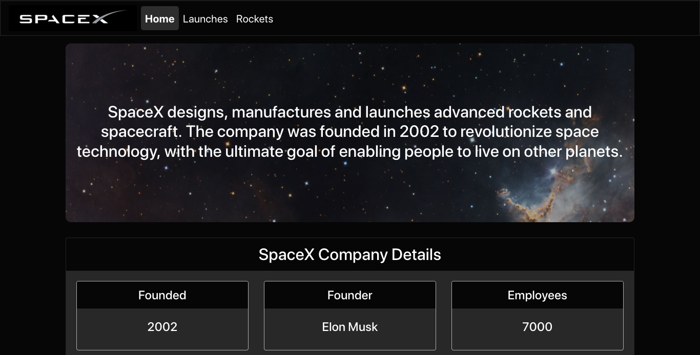

# SpaceX Stats
## SpaceX fan page with information on launches and rockets

### Technologies Utilized
* React
* React-Apollo
* GraphQL
* Express.js
* Node.js

#### Desktop Views:

#### Mobile View:

#### Visit website => [SpaceX Stats](https://spacex-stats.herokuapp.com/)
